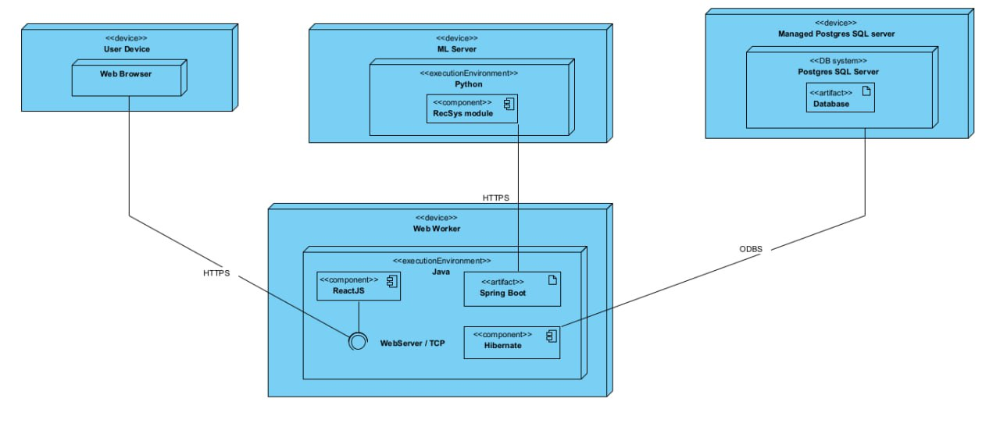

# movie-selection-together
Рекомендательная система фильмов и сериалов на основе просмотренного контента
## Технологии и Языки Программирования

### Backend:

* Основная логика: Java + Spring Boot

* Обработка данных и ML: Python + подходящая ML-библиотека

* Обмен сообщениями: Apache Kafka

* СУБД: PostgreSQL

### Frontend:

* React.js (возможно с использованием TypeScript для статической типизации)

### Дополнительные технологии:

* Docker

* GraphQL (опционально, для оптимизации запросов между frontend и backend)

* Git (система контроля версий)

## Функциональный Объем Проекта

### Пользовательские Функции:

* Регистрация/авторизация

* Просмотр карточек фильмов/сериалов

* Свайп карточек для выражения предпочтений

* Просмотр рекомендованных фильмов/сериалов

* Оценка на фильмы/сериалы

* Добавление в "Избранное"

### Административные Функции:

* CRUD операции над карточками фильмов/сериалов

* Просмотр статистики использования приложения

* Управление пользователями

## Нефункциональные Требования

### Производительность:

* Поддержка до 100 одновременных пользователей.

* Быстрая загрузка страницы (желательно в пределах 2-3 секунд).

* Низкое время отклика сервера (не более 200-300 мс).

### Безопасность:

* Защита данных и паролей.

* Аутентификация и авторизация пользователей.

### Интерфейс:

* Интуитивно понятный UX/UI дизайн.

* Адаптивный дизайн под различные разрешения экранов.

### Отзывчивость:

* Эффективная работа в различных браузерах.

## Архитектура Проекта

### Frontend:

* MPA на React.js для пользовательского интерфейса.

### Backend:

1. API-сервер:

* Разработан на Java + Spring Boot.

* Обрабатывает запросы от фронтенда.

* Управляет регистрацией, аутентификацией и профилями пользователей

* Взаимодействует с отдельной СУБД (например, PostgreSQL).

2. Микросервис Рекомендаций:

* Разработан на Python.

* Генерирует рекомендации и отправляет их на API-сервер.

### База данных:

* Отдельная СУБД (например, PostgreSQL), взаимодействующая только с API - сервер для работы с БД.

* Схема БД должна быть спроектирована так, чтобы оптимизировать запросы, необходимые для функционирования системы рекомендаций и обеспечения пользовательского опыта.

